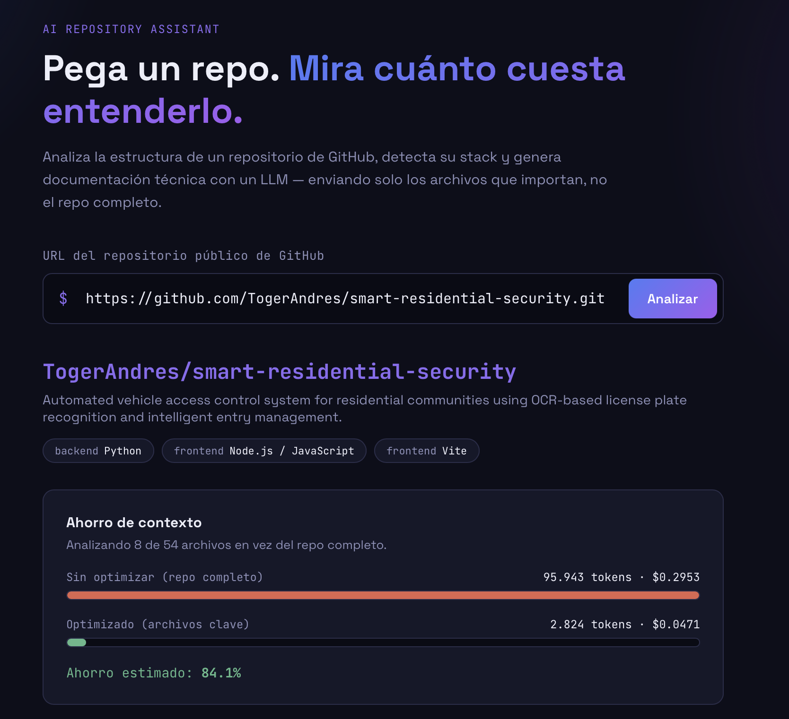
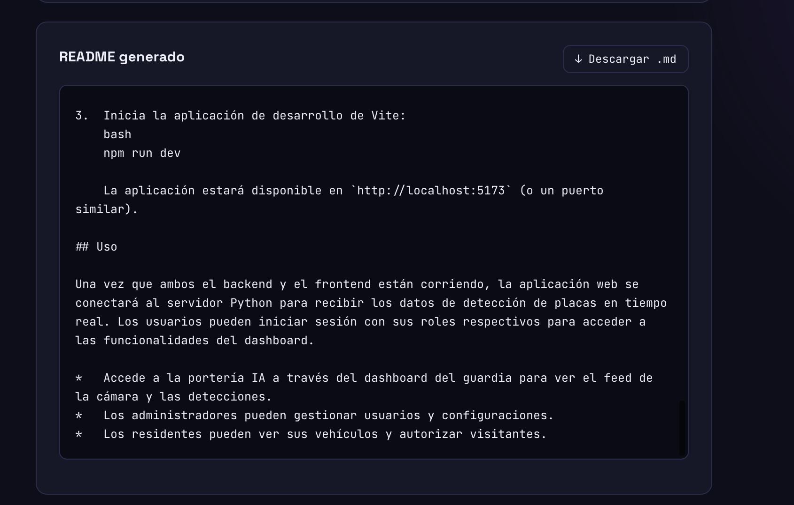
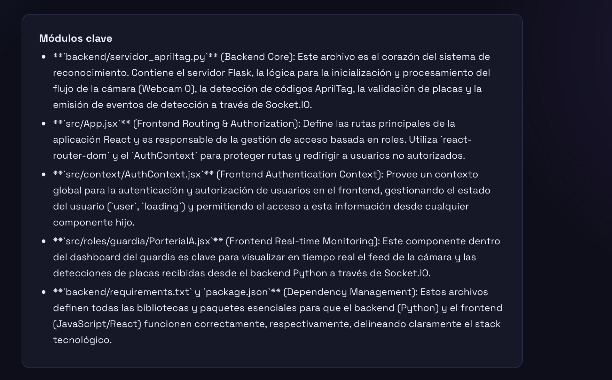
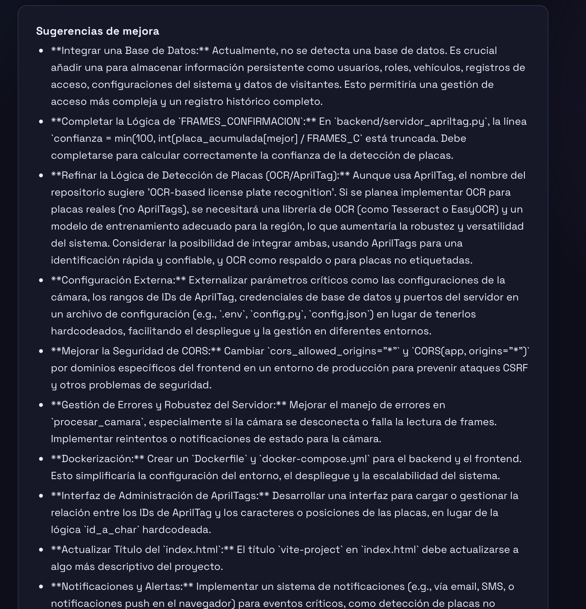

<div align="center">

# 🤖 AI Repo Analyzer

### Paste a repo. See how much it costs to understand it.

Analyze any public GitHub repository, detect its tech stack, and automatically generate
technical documentation with an LLM — sending only the files that actually matter, not the
entire repository.

[](https://www.python.org/)
[](https://flask.palletsprojects.com/)
[](https://react.dev/)
[](https://vitejs.dev/)
[](https://ai.google.dev/)
[](#license)

</div>

<br>

<p align="center">
  
</p>

---

## 📌 What problem does it solve?

Understanding a new repository — for onboarding, a technical review, or evaluating whether
a third-party library is worth using — takes hours of manual reading. Sending an LLM the
entire repo to summarize it is expensive and inefficient: most files add nothing to
understanding the overall architecture.

**AI Repo Analyzer** solves this by intelligently selecting only the files that truly
describe the project (configuration, dependencies, and entry points), measuring in real
time how many tokens and how much money you save compared to the "naive" approach of
sending the whole repository.

## ✨ Features

- 🔎 **Public GitHub repository analysis** from just the URL.
- 🧠 **Automatic tech stack detection** (backend, frontend, database, infra) based on the
  presence of key files (`package.json`, `requirements.txt`, `Dockerfile`, etc.).
- 📂 **Smart context selection**: instead of sending the whole repo, it picks configuration
  files and entry points, and explains the reason behind each selection.
- 🛡️ **Hallucination-free documentation generation**: the prompt forces the model to
  explicitly state when it can't confirm something from the analyzed files, instead of
  inventing technologies that aren't actually present in the repository.
- 📊 **"Naive vs. optimized" cost comparison** in tokens and USD, showing the real
  percentage savings from context optimization.
- ⏱️ **Run metrics**: analysis time, model used, and token breakdown
  (prompt / response / total).
- 📄 **Auto-generated README, summary, key modules, and improvement suggestions**,
  downloadable as Markdown.

## ⚙️ How it works

```
Frontend (React)
      │  Repo URL
      ▼
Backend (Flask)
      │  1. Reads the full file tree via the GitHub API
      │  2. Detects the stack by presence of key files (no AST parsing)
      │  3. Selects a representative subset of files
      │     (config + entry points) instead of the whole repo
      │  4. Counts context tokens with tiktoken
      ▼
LLM (Gemini 2.5 Flash)
      │  Generates README, summary, key modules, and suggestions
      │  under strict anti-hallucination rules
      ▼
Frontend (React)
      Shows everything: detected stack, analyzed files with their selection reason,
      analysis time, tokens, cost, and savings comparison
```

## 🖼️ Screenshots

<table>
<tr>
<td width="50%">

**Analysis and context savings**

Detected stack, analyzed files, and the token/cost comparison between the
unoptimized approach (full repo) and the optimized one (key files).


</td>
<td width="50%">

**Auto-generated README**

Complete technical documentation generated by the LLM from the selected
context, downloadable as `.md` with one click.



</td>
</tr>
<tr>
<td width="50%">

**Identified key modules**

The model points out the most important files in the repository and explains
the role of each one within the architecture.



</td>
<td width="50%">

**Improvement suggestions**

Concrete technical recommendations (security, configuration, architecture)
based solely on what was found in the analyzed files.



</td>
</tr>
</table>

## 🧰 Tech stack

| Layer | Technology |
|---|---|
| Backend | Python, Flask, Flask-CORS |
| LLM | Gemini 2.5 Flash (`google-genai`) |
| Token counting | tiktoken |
| External integration | GitHub REST API |
| Frontend | React 19, Vite |
| Suggested deployment | Vercel (frontend) + Render (backend) |

## 📁 Project structure

```
backend/
  app/
    __init__.py           # Flask app + /api/analyze endpoint
    services/
      github_service.py   # GitHub API communication + stack detection
      analyzer_service.py # Token counting + context building
      llm_service.py       # LLM call to generate documentation
  run.py
  requirements.txt
  .env.example

frontend/
  src/
    App.jsx
    components/
      RepoForm.jsx
      ResultsView.jsx
    services/
      api.js
  package.json
  vite.config.js

docs/
  screenshots/            # Screenshots used in this README
  propuesta_original.md   # Original project proposal/scope document
```

## 🚀 Running it locally

### Backend

```bash
cd backend
python3 -m venv venv
source venv/bin/activate          # on Windows: venv\Scripts\activate
pip install -r requirements.txt
cp .env.example .env
# Edit .env and add your GEMINI_API_KEY (and optionally GITHUB_TOKEN)
python run.py
```

The backend will be running at `http://localhost:5001`.

### Frontend

```bash
cd frontend
npm install
npm run dev
```

The frontend will be running at `http://localhost:5173` (or whichever port Vite picks) and
already has a proxy configured for `/api` to the backend to avoid CORS issues in development.

## 🔐 Environment variables

| Variable | Required | Description |
|---|---|---|
| `GEMINI_API_KEY` | Yes | Used to generate the README/summary with Gemini. Get one at [aistudio.google.com](https://aistudio.google.com/) |
| `GITHUB_TOKEN` | No | Raises the GitHub API rate limit from 60 to 5000 req/hour. Create one at [github.com/settings/tokens](https://github.com/settings/tokens) |

## ☁️ Suggested free deployment

- **Frontend** → Vercel (connect the repo, *root directory* `frontend`)
- **Backend** → Render (*root directory* `backend`, build command
  `pip install -r requirements.txt`, start command `gunicorn run:app`)
- Set the environment variables (`GEMINI_API_KEY`, `GITHUB_TOKEN`) in the Render
  dashboard — never commit them to the repository.

## 🗺️ Roadmap (v2)

- [ ] Auto-generated architecture diagrams (Mermaid) based on the analysis
- [ ] Automatic detection of architecture pattern (monolith, client-server, MVC, etc.)
- [ ] Project metrics: % per language, number of folders/files, dependencies
- [ ] Automatic repository quality score (documentation, architecture, security)
- [ ] Caching of previous analyses (avoids re-spending tokens on the same repo)
- [ ] Export results to PDF / DOCX / HTML
- [ ] History of analyzed repositories
- [ ] Support for private repositories (GitHub OAuth)
- [ ] Tree-sitter for real function/class detection per file
- [ ] ChromaDB + embeddings for real RAG on large repositories

## 💼 How to pitch it on a resume

> Built a backend tool that analyzes GitHub repositories and automatically generates
> technical documentation using an LLM, detecting the tech stack and optimizing the context
> sent to the model (cuts up to ~84% of tokens sent by selecting key files instead of the
> full repo). Implemented with Flask, React, the GitHub API, and the Gemini API.

**Problem → Solution → Impact**

- **Problem**: understanding a new repository takes hours of manual reading, and sending it
  in full to an LLM is costly and inefficient.
- **Solution**: automatic selection of key files + documentation generation with optimized
  context and anti-hallucination rules, instead of brute force.
- **Impact**: reduces onboarding time and demonstrates measurable cost savings (tokens and
  USD) compared to the naive approach.

## 📄 License

MIT — free to use, modify, and distribute.

## 👤 Author

**Roger Andrés Álvarez Díaz (Toger)**
Computer Science and Systems Engineering student — UAO

- GitHub: [github.com/TogerAndres](https://github.com/TogerAndres)
- LinkedIn: [roger-andrés-alvarez-diaz](https://www.linkedin.com/in/roger-andrés-alvarez-diaz-52b395333/)
